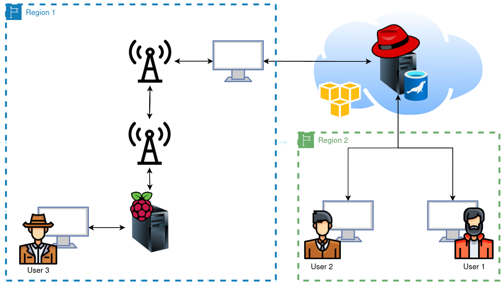
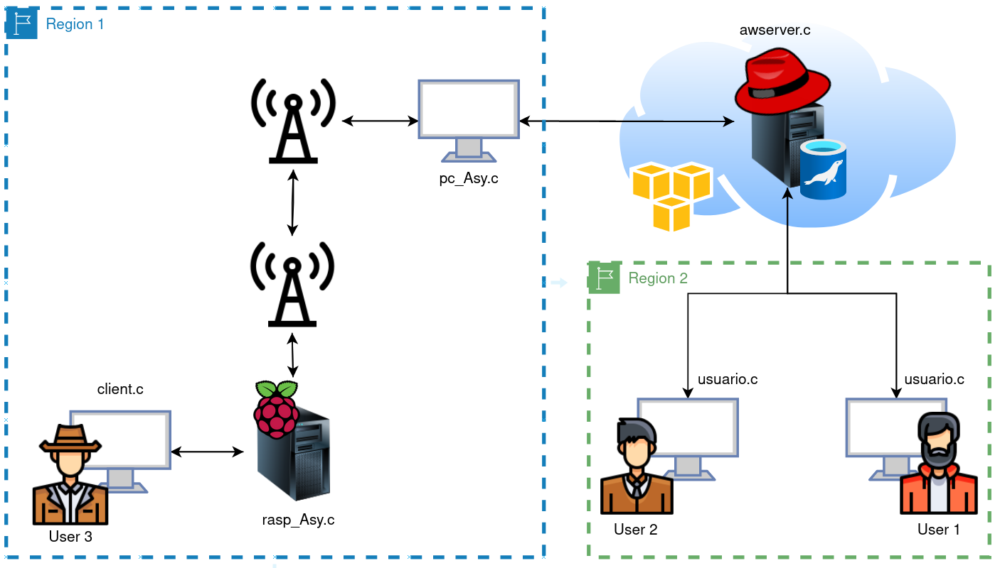
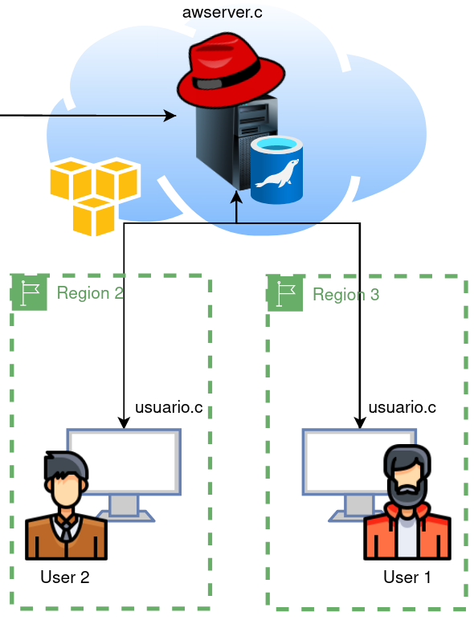

# Telecom-platform
This is a telecommuncations platform that was created for the course "Taller de Comunicaciones Eléctricas" using an EC2 instance running CentOS 8, a Raspberry Pi 4 and 2 transceviers.

Here you can find a diagram of the project:

  

## What's in the repo?

### MariaDB examples folder

1. Client and server to run make changes on MariaDB (client.c and server.c)
2. Client using remote mysql connection to make changes on the database (client_remote_connection.c)

>**NOTE:**
> The RECOMMENDED implementation is the 1.
> This way you wont need to have the MariaDB client installed on the users.

### Socket examples folder

1. Asynchronous communication
2. Basics
3. Bidirecctional
4. Send images using sockets

### Transceivers examples folder

1. configuration.c is used for setting the boud rate to the transceivers.
2. The rest of the code is a example on how to create a wireless communication between a respberry pi and a PC using 2 transceivers. 

### Final Project folder

This contains all of the code necessary to make the platfrom 100% functional with all of the requirements. (Initialization protocol, Error detection, Statistics information, etc)

1. awserver.c needs to be deployed on the AWS ec2 instance. 
2. client.c is executed on the phone or computer (user 3)
3. pc_Asy.c is executed on the PC that is connected to the transceiver. 
4. rasp_Asy.c is excecuted on the Raspberry Pi 4 (this must have the transceiver connected onto the pins)
5. usuario.c is executed on the users 1 & 2.

Here you can see a diagram on where to compile the code:

  

## Important notes

Notice that since the AWS instance has a public IP address accessible from any location. You can have both users on different geographical locations.

  

User 1 is identified as 'P' (the phone user)
User 2 is identified as 'A'
User 3 is identified as 'B'
